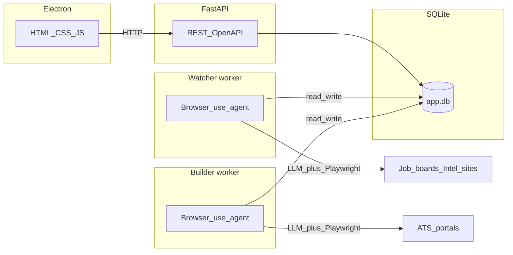

# Two-Agent Job Application System — Plan (browser-use agents first)

**Repository:** [github.com/Khangnn00/DiamondHacks2026](https://github.com/Khangnn00/DiamondHacks2026) — optional move to a GitHub org: [docs/GITHUB_TEAM.md](docs/GITHUB_TEAM.md).  
**Status:** Scaffold on `main` — implementation tracked in milestones below.  
**Last updated:** 2026-04-04

**Project name:** TBD.

**North star:** The whole point is **browser-use agents** — LLM-driven agents that control a real browser (Playwright under the hood) to navigate Handshake, LinkedIn, GitHub, Glassdoor, and ATS portals. **Deterministic Playwright scripts are fallback only** (e.g. upload file widget edge cases). Use **Cursor agents** to iterate **task prompts**, guardrails, and evaluation—not to replace this architecture.

**Runtime LLM usage (three roles, can share one provider):**

1. **Browser agents** — `browser-use` decides *click/type/navigate* from goals + page state.
2. **Scoring / reasoning** — structured JSON (match 1–10, rationale) from job + resume + intel.
3. **Documents** — tailored resume + cover letter text after approval.

---

## Architecture (who calls what)



- **Electron** only talks to **your FastAPI** — it never runs browser-use.
- **Watcher** and **Builder** are where **browser-use agents** run (headed or headless; headed helps demo/debug).

---

## Full stack (single reference)

| Layer | Technology | Role |
|-------|------------|------|
| **Desktop UI** | **Electron** + HTML/CSS/JS | Dashboard, onboarding, approve/skip — **`fetch` → FastAPI only** |
| **Your API** | **FastAPI** + **Uvicorn** | REST + **OpenAPI**; persistence; enqueue builder jobs |
| **Database** | **SQLite** + WAL + busy_timeout | State, outbox, logs |
| **ORM** | **SQLModel** + **Alembic** | Models / migrations |
| **Queue** | **SQLite outbox** | `SKIP LOCKED` for builder jobs |
| **Automation (core)** | **[browser-use](https://github.com/browser-use/browser-use)** + **Playwright** | Agents for discovery, intel, apply |
| **Automation (fallback)** | **Playwright** only | Thin helpers (upload, wait) |
| **LLM providers** | **Anthropic** (primary) | browser-use + scoring + documents |
| **Resume files** | `backend/uploads/` | Uploaded via API; paths in DB |

**Auth:** None v1; optional `DEMO_API_KEY` + `X-API-Key`.

### Hackathon data layer (explicit)

**SQLite only** for persisted data (one file, e.g. `backend/data/app.db`). **No Supabase, no Postgres, no Neon** — keeps setup fast and matches local demo + multi-process workers with WAL. If the team outgrows SQLite after the event, migrating to hosted Postgres is a follow-up, not in v1 scope.

---

## External APIs and keys

See [`.env.example`](.env.example) for copy-paste names.

| Variable | Required? | Used by |
|----------|-----------|---------|
| `ANTHROPIC_API_KEY` | **Yes** (for this stack) | browser-use (if Claude), scoring, documents |
| `OPENAI_API_KEY` | Optional | If browser-use points at OpenAI |
| `GITHUB_TOKEN` | Optional | GitHub REST / rate limits |
| `DEMO_API_KEY` | Optional | FastAPI gate |
| `DEMO_MODE` | Optional | Fixtures / safe demo |
| `APP_API_BASE_URL` | For Electron | Default `http://127.0.0.1:8000` |
| `DATABASE_URL` | Yes | SQLite path |

After `pip install`, run **`playwright install chromium`**.

---

## Repository layout (this repo)

```
backend/app/agent_tasks/   # YAML/MD task specs (prompts + metadata)
backend/app/services/      # browser_agent.py, claude_client.py
backend/app/workers/       # watcher_main.py, builder_main.py
backend/app/api/           # FastAPI routers (when implemented)
desktop/                   # Electron
docs/SETUP.md
```

---

## Product constraints

- Human **Approve** before Builder runs apply agent.
- **`DEMO_MODE`** may stop before final submit.
- **GitHub + Glassdoor intel** — agent and/or API hybrid.

---

## Pipeline

1. **Watcher** — browser-use tasks → intel → Claude scores → DB.
2. **Electron** — pending matches (e.g. score ≥ 7).
3. **Approve** → outbox.
4. **Builder** — browser-use apply task → **ApplicationLog** + traces.

---

## Implementation milestones (not done in scaffold)

- [ ] SQLModel models + Alembic migrations
- [ ] FastAPI routes (profile, candidates, approve, logs)
- [ ] `services/browser_agent.py` + first smoke task
- [ ] Watcher loop + Builder consumer
- [ ] Real Handshake / LinkedIn task prompts

---

## Out of scope (v1)

No auto-submit without approval; no mobile; 2–3 ATS task profiles; no multi-tenant auth.
